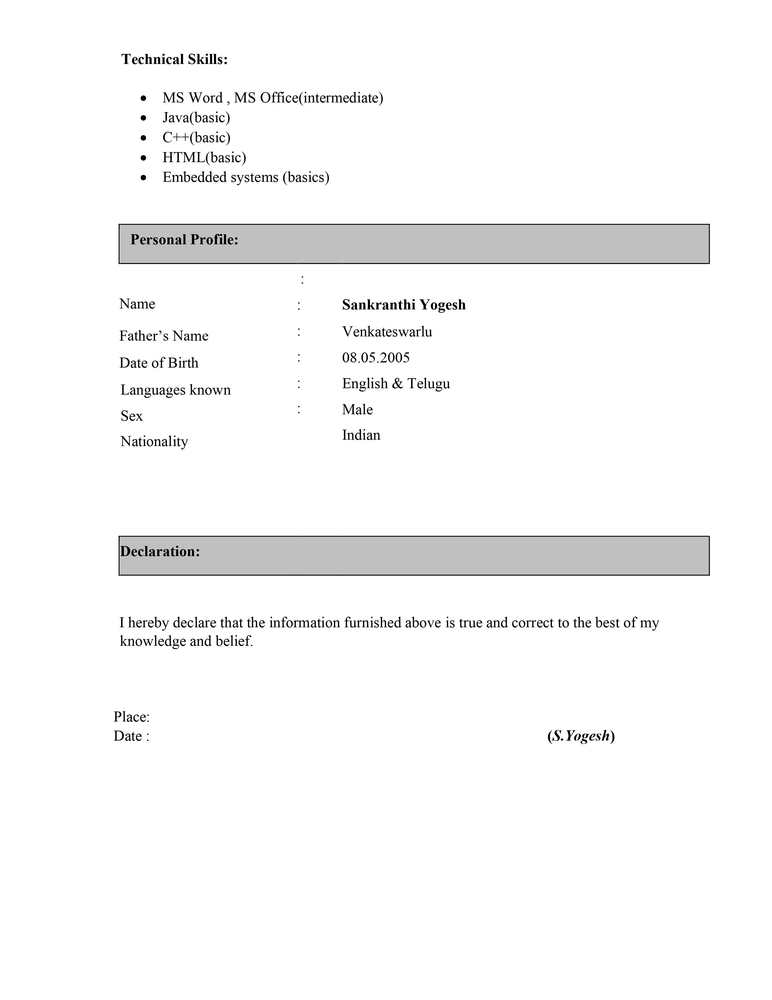

# YOGESH - Portfolio

Welcome to my professional portfolio! This website showcases my skills, projects, and professional journey as a Software Developer. Here, you can learn more about my background, see the projects I've worked on, and view my resume.

## Table of Contents

- [About Me](#about-me)
- [Projects](#projects)
- [Resume](#resume)
- [Technologies Used](#technologies-used)
- [How to Use](#how-to-use)
- [Contact](#contact)

## About Me

As a dedicated Computer Engineering student with a passion for coding and data structures, I strive to harness the power of technology to solve complex problems and create innovative solutions. With a keen interest in browsing and cricket, I bring a dynamic perspective to my work, continuously seeking new challenges to expand my skill set. My journey as a learner has led me to master SQL alongside various coding languages, enabling me to navigate the intricate landscapes of software development with confidence and precision.

My vision is to become a respected software developer committed to continuously learning and embracing new technologies. I am driven by a desire to make a positive impact and dedicated to leveraging my expertise to mentor and empower others. Through my consultancy, FIBNOCICS CONSULTANCY, I provide comprehensive support to individuals seeking to excel in their academic pursuits.

## Projects

Here are some of the projects I've worked on:

### WEB BROWSER

A GUI-based Web Browser built using Python and the PyQt5 library. This project demonstrates an intermediate understanding of the PyQt5 library and its modules, including the WebEngineWidgets module. The web browser supports various features such as navigating through websites, bookmarking, and more.

- **Project Prerequisites:**
  - PyQt5
  - sys.argv
  - PyQt5.QtCore.QUrl
  - PyQt5.QtWidgets
  - PyQt5.QtWebEngineWidgets.QWebEngineView

[View Project Proposal (PDF)](Project%20proposal.pdf)

### Additional Projects

- _Project 1 Name_ - Brief description of Project 1.
- _Project 2 Name_ - Brief description of Project 2.
- _Project 3 Name_ - Brief description of Project 3.

## Resume

Below are the images of my resume. You can click on them to view in full size.

## Technologies Used

- HTML5
- CSS3
- JavaScript
- Python (for project-specific work)
- PyQt5 (for the Web Browser project)

Here's a detailed description for your GitHub README.md file:

markdown
Copy code

# YOGESH - Portfolio

Welcome to my professional portfolio! This website showcases my skills, projects, and professional journey as a Software Developer. Here, you can learn more about my background, see the projects I've worked on, and view my resume.

## Table of Contents

- [About Me](#about-me)
- [Projects](#projects)
- [Resume](#resume)
- [Technologies Used](#technologies-used)
- [How to Use](#how-to-use)
- [Contact](#contact)

## About Me

As a dedicated Computer Engineering student with a passion for coding and data structures, I strive to harness the power of technology to solve complex problems and create innovative solutions. With a keen interest in browsing and cricket, I bring a dynamic perspective to my work, continuously seeking new challenges to expand my skill set. My journey as a learner has led me to master SQL alongside various coding languages, enabling me to navigate the intricate landscapes of software development with confidence and precision.

My vision is to become a respected software developer committed to continuously learning and embracing new technologies. I am driven by a desire to make a positive impact and dedicated to leveraging my expertise to mentor and empower others. Through my consultancy, FIBNOCICS CONSULTANCY, I provide comprehensive support to individuals seeking to excel in their academic pursuits.

## Projects

Here are some of the projects I've worked on:

### WEB BROWSER

A GUI-based Web Browser built using Python and the PyQt5 library. This project demonstrates an intermediate understanding of the PyQt5 library and its modules, including the WebEngineWidgets module. The web browser supports various features such as navigating through websites, bookmarking, and more.

- **Project Prerequisites:**
  - PyQt5
  - sys.argv
  - PyQt5.QtCore.QUrl
  - PyQt5.QtWidgets
  - PyQt5.QtWebEngineWidgets.QWebEngineView

[View Project Proposal (PDF)](Project%20proposal.pdf)

### Additional Projects

- _Project 1 Name_ - Brief description of Project 1.
- _Project 2 Name_ - Brief description of Project 2.
- _Project 3 Name_ - Brief description of Project 3.

## Resume

Below are the images of my resume. You can click on them to view in full size.

## Technologies Used

- HTML5
- CSS3
- JavaScript
- Python (for project-specific work)
- PyQt5 (for the Web Browser project)

Email: yogeshsankranthi131@gmail.com
LinkedIn: https://www.linkedin.com/in/s-yogesh-chowdary-b04835293/
GitHub: https://github.com/syogesh999

Thank you for visiting my portfolio! I look forward to connecting with you.
